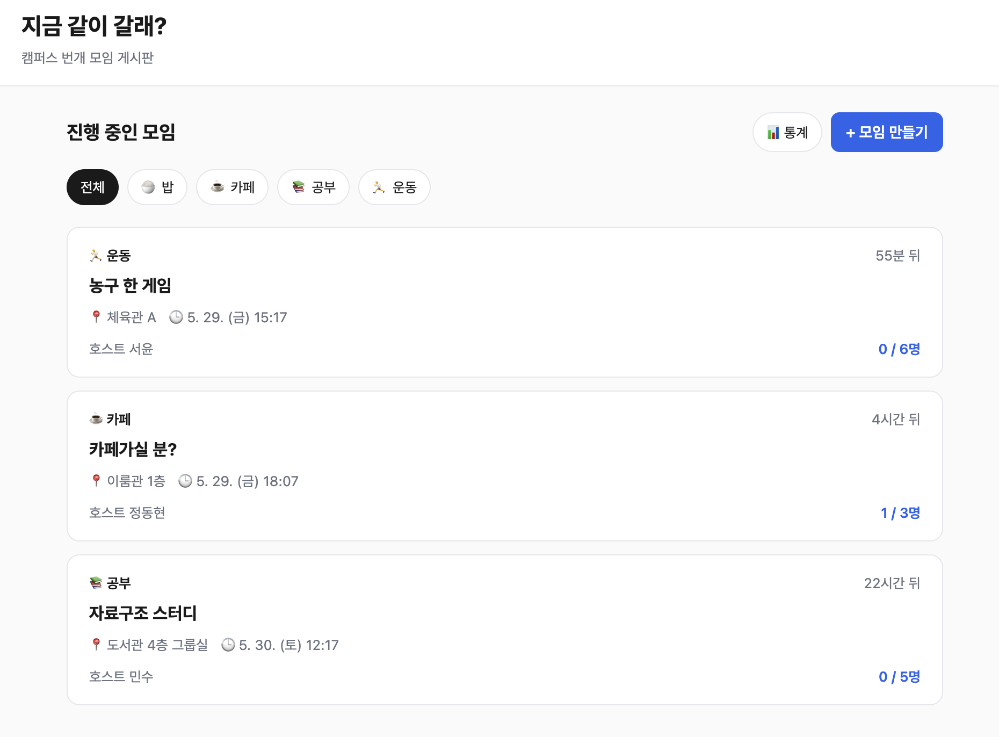
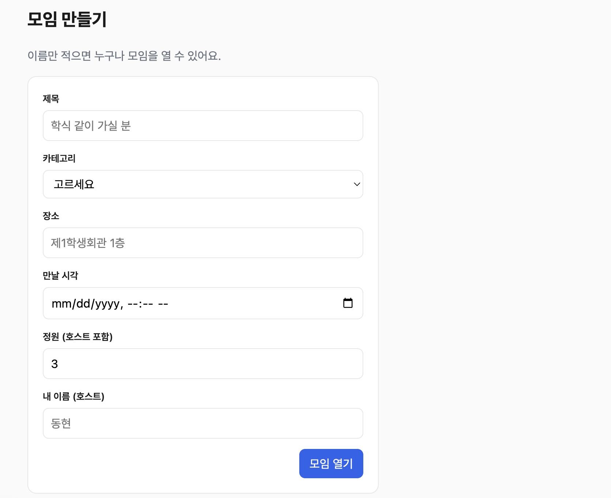
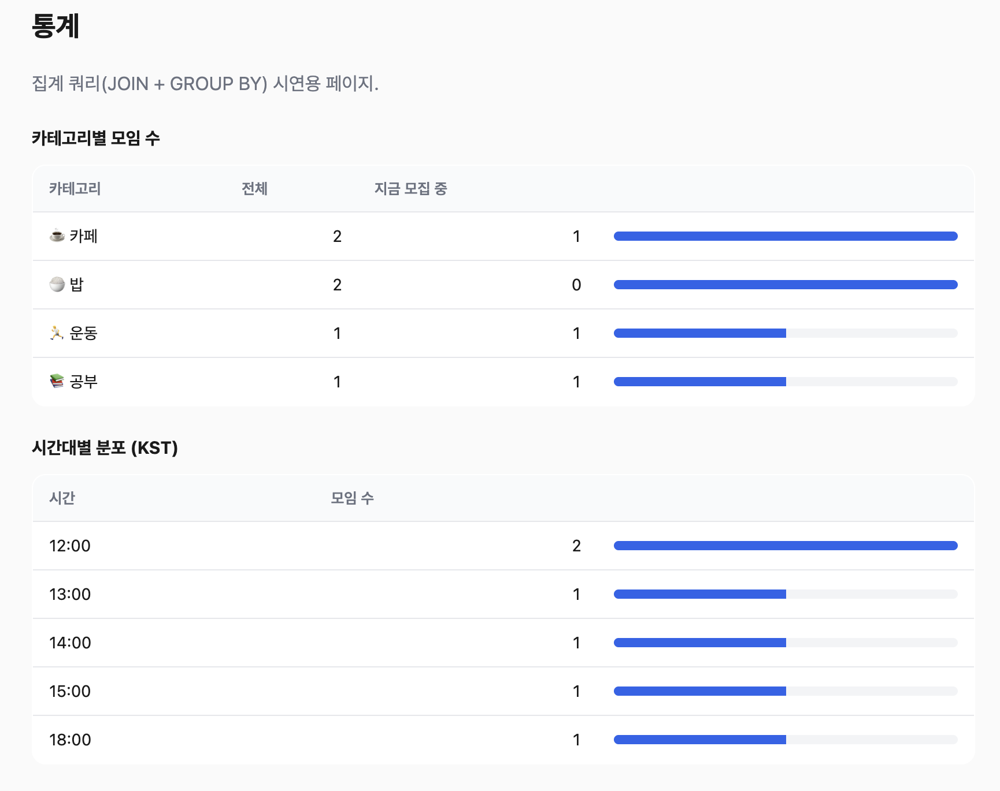
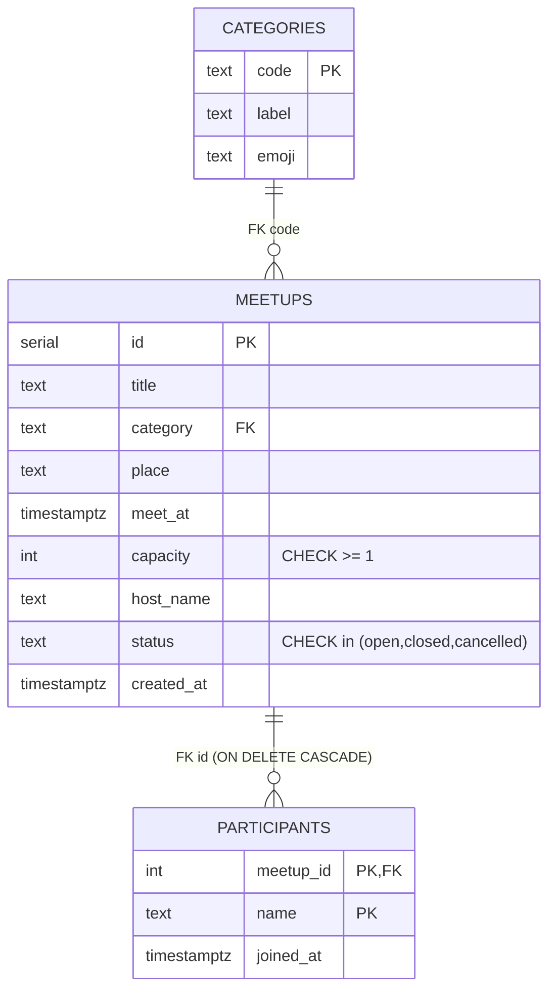

# db-project — "지금 같이 갈래?"

데이터베이스 과목 기말 프로젝트.
**캠퍼스 번개 모임 게시판** 을 PostgreSQL · Express · Next.js 로 구현하며
릴레이션 / 쿼리 / 트랜잭션 의 정의와 활용을 직접 연습한다.

> 학습 목표 및 슬라이스 분할은 [docs/PRD.md](docs/PRD.md), 과제 안내는 [docs/ASSIGNMENT.md](docs/ASSIGNMENT.md) 참고.

## 스크린샷

| 목록 | 모임 만들기 | 통계 |
|---|---|---|
|  |  |  |

## 폴더 구조

```
db-project/
├── db/                  # SQL 단일 진실의 원천
│   ├── schema.sql       # 3개 테이블 + 제약조건 + 인덱스
│   └── seed.sql         # 카테고리 4종 + 데모 모임/참여자
├── server/              # Express + node-postgres
│   ├── db.js            # deep module: query() / withTransaction() / close()
│   ├── joinMeetup.js    # ★ 선착순 참여 트랜잭션
│   ├── routes/
│   │   ├── meetups.js   # GET/POST, GET/:id, POST/:id/join
│   │   └── stats.js     # GET /stats
│   ├── __tests__/joinMeetup.test.js   # 7 tests (실제 Postgres)
│   └── package.json
├── web/                 # Next.js App Router (SSR)
│   ├── app/
│   │   ├── layout.tsx
│   │   ├── page.tsx                   # 목록 + 카테고리 필터
│   │   ├── new/{page,form}.tsx        # 만들기
│   │   ├── meetups/[id]/{page,join-form,not-found}.tsx  # 상세 + 참여
│   │   ├── stats/page.tsx             # 통계
│   │   ├── health/page.tsx            # 헬스 체크
│   │   └── globals.css
│   ├── lib/{api,types,format}.ts
│   └── package.json
├── scripts/
│   └── concurrency-demo.js   # FOR UPDATE 유무 비교 시연
├── docker-compose.yml        # postgres:16 + schema/seed 자동 적용
└── docs/
    ├── ASSIGNMENT.md
    ├── PRD.md
    └── PPT_OUTLINE.md
```

## 사전 요구사항

- Docker Desktop
- Node.js 22+ (현재 검증: v25)
- npm 10+

## 로컬 실행

```bash
# 1) PostgreSQL 기동 + 스키마/시드 자동 적용
docker compose up -d

# 2) Express 서버 (포트 3001)
cd server && npm install && npm start

# 3) Next.js (포트 3000) — 새 터미널
cd web && npm install && npm run dev
```

브라우저: http://localhost:3000

## 테스트

```bash
cd server
npm test                     # 7 tests (joinMeetup, 실제 Postgres 사용)
```

## 발표용 동시성 데모

```bash
cd scripts && npm install
node concurrency-demo.js
```

출력 예 (정원 2명에 5명이 동시 시도):

```
=== (A) FOR UPDATE 없이 ===
정원: 2, 시도자: 5명
  ✓ A: 성공   ✓ B: 성공   ✓ C: 성공   ✓ D: 성공   ✓ E: 성공
→ 최종 DB 참여자 수: 5
  ⚠️  정원 초과 발생 (5 > 2)

=== (B) FOR UPDATE 있이 ===
정원: 2, 시도자: 5명
  ✓ A: 성공   ✗ B: full   ✗ C: full   ✗ D: full   ✓ E: 성공
→ 최종 DB 참여자 수: 2
  ✅ 무결성 유지 (2 ≤ 2)
```

## ERD



## 제약조건과 의도

| 제약 | 위치 | 이유 |
|---|---|---|
| `PRIMARY KEY (id)` | `meetups` | 모임의 자연 식별자가 없어 SERIAL 부여 |
| `PRIMARY KEY (meetup_id, name)` | `participants` | 복합 PK 가 곧 "한 사람당 한 모임 1회 참여" 무결성 |
| `FOREIGN KEY category → categories.code` | `meetups` | 존재하지 않는 카테고리 차단 (`23503` 으로 잡아 400 응답) |
| `FOREIGN KEY meetup_id → meetups.id ON DELETE CASCADE` | `participants` | 모임 삭제 시 참여자 자동 정리 |
| `CHECK (capacity >= 1)` | `meetups` | 의미 없는 0명 모임 방지 |
| `CHECK (status IN ('open','closed','cancelled'))` | `meetups` | 상태 enum 강제 (애플리케이션 버그 방어 1차선) |
| `CHECK (length(...) > 0)` | `title`, `place`, `host_name`, `name` | 빈 문자열 차단 — 트림 후 검증을 DB 가 backstop |
| `DEFAULT NOW()` | `created_at`, `joined_at` | 클라이언트 시각 신뢰하지 않음 — 서버 클락 통일 |
| `DEFAULT 'open'` | `status` | 생성 시 명시 안 해도 안전한 기본값 |

## 인덱스 의도

| 인덱스 | 이유 |
|---|---|
| `idx_meetups_open_meet_at (meet_at) WHERE status='open'` | 목록 조회의 핫 쿼리 `WHERE status='open' AND meet_at > NOW()` 를 partial index 로 가속 |
| `idx_meetups_category (category)` | 카테고리 필터 |
| `idx_participants_meetup (meetup_id)` | 상세 조회의 참여자 lookup |

## 핵심 쿼리의 EXPLAIN ANALYZE

목록 조회(`/meetups`) — 5건 결과, **0.10ms 미만**:

```
 Sort  (cost=30.13..30.14 rows=1 width=163) (actual time=0.058..0.059 rows=5)
   Sort Key: m.meet_at
   ->  GroupAggregate  (cost=30.10..30.12) (actual time=0.044..0.047 rows=5)
         Group Key: m.id, c.code
         ->  Sort
               ->  Nested Loop Left Join  (actual time=0.017..0.026 rows=8)
                     ->  Nested Loop
                           ->  Index Scan using idx_meetups_open_meet_at on meetups m  ← 부분 인덱스 사용
                                 Index Cond: (meet_at > now())
                           ->  Index Scan using categories_pkey on categories c
                                 Index Cond: (code = m.category)
                     ->  Bitmap Heap Scan on participants p
                           ->  Bitmap Index Scan on idx_participants_meetup
 Planning Time: 0.399 ms
 Execution Time: 0.096 ms
```

핵심: 우리가 만든 partial index `idx_meetups_open_meet_at` 이 적중되어 시퀀셜 스캔 없이 즉시 응답.

## ★ 핵심 트랜잭션 — `joinMeetup`

`server/joinMeetup.js` — 호출자에게는 다음 결과만 노출.

```
joinMeetup(meetupId, name)
  → { ok: true } | { ok: false, reason: 'full' | 'closed' | 'duplicate' }
```

내부 흐름 (단일 트랜잭션):

1. `BEGIN`
2. `SELECT ... FOR UPDATE` — 모임 행 잠금
3. **현재 참여자 수 검사 (capacity)** — 동시성 환경에서 `full` 을 정확히 보고하려면 status 검사보다 먼저 수행
4. `status` / `meet_at` 검사 — `closed`
5. `INSERT participants` — `23505`(PK 중복) → `duplicate`
6. 정원 채워졌으면 `UPDATE meetups SET status='closed'`
7. `COMMIT`

테스트 7건 (`server/__tests__/joinMeetup.test.js`):
1. happy path
2. full
3. duplicate
4. **동시성: 정원 2명에 5명 → 정확히 2명만 성공**
5. 정원 채우면 자동 closed
6. 시각이 과거인 모임 → closed
7. 명시적 closed 상태인 모임 → closed

```bash
$ npm test
✔ 1) 정원 남은 모임에 1명 참여 → ok
✔ 2) 정원이 꽉 찬 모임 → reason=full
✔ 3) 같은 이름 2회 참여 → reason=duplicate
✔ 4) 정원 2명에 5명 동시 참여 → 정확히 2명만 성공
✔ 5) 정원이 채워지면 status 자동 closed
✔ 6) meet_at 이 과거인 모임 → reason=closed
✔ 7) status=closed 인 모임 → reason=closed
ℹ pass 7  ℹ fail 0
```

## API

| Method | Path | 설명 |
|---|---|---|
| GET | `/health` | 헬스체크 |
| GET | `/meetups[?category=]` | 목록 (open 만, 미래만, 카테고리 필터 가능) |
| POST | `/meetups` | 생성 |
| GET | `/meetups/:id` | 상세 + 참여자 |
| POST | `/meetups/:id/join` | 선착순 참여 (트랜잭션) |
| GET | `/stats` | 카테고리/시간대 집계 |

## 정리

```bash
docker compose down            # 컨테이너 제거 (데이터 유지)
docker compose down -v         # 데이터까지 완전 삭제
```

## 진행 상황

이슈 트래킹: Linear `db-project` 팀 (DBP-1 ~ DBP-7).

- [x] DBP-1 Foundation
- [x] DBP-2 목록 조회
- [x] DBP-3 모임 만들기
- [x] DBP-4 상세 페이지
- [x] DBP-5 통계 페이지
- [x] DBP-6 ★ 참여 트랜잭션 (joinMeetup, 7 tests passing)
- [x] DBP-7 발표 자료
