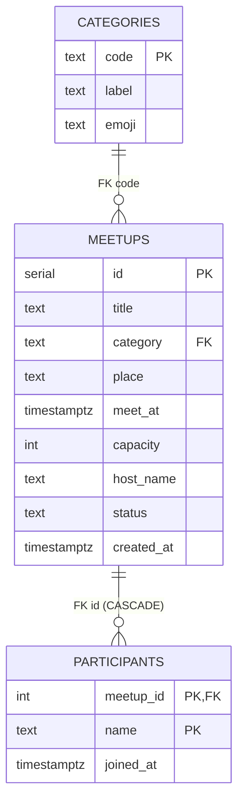

# PPT 아웃라인 — db-project

발표용 8-slide 구성. DB 전공수업 발표용 — 슬라이드마다 실제 코드·쿼리·EXPLAIN 결과를 포함한다.

---

## Slide 1 · 컨셉과 데모

**메시지**: "캠퍼스에서 30분 뒤 학식 같이 갈 사람을 모으는 가장 가벼운 게시판."

**보여줄 것**
- 한 줄 컨셉
- 스크린샷 3장: 목록 / 만들기 / 상세
- 라이브 데모는 발표 마지막에 다시 — 여기는 정지 화면만

---

## Slide 2 · 아키텍처와 시스템 구성

**메시지**: "Next.js → Express → PostgreSQL 3-레이어. 데이터 모델은 단 3개 테이블."

**아키텍처 다이어그램**

```
Browser ─ HTTP ─→ Next.js (3000) ─ HTTP ─→ Express (3001) ─ pg pool ─→ PostgreSQL (5432)
   ▲              SSR/RSC               얇은 라우트          deep module        Docker
   │                                                          (db.js)
   └─────────────────────────────────────────────────────────────── 단방향 흐름
```

**의도적 분리 이유**
- 백엔드와 프론트 책임 분리 → "DB 가 어떻게 호출되는지" 가 코드에서 명확
- ORM 없이 직접 SQL → 학습 목표에 부합. SQL 이 그대로 코드에 노출됨
- pg 모듈만 사용 — connection pooling, parameterized query, SQLSTATE 접근 가능

**스택 결정 한 줄 요약**: "DB 학습을 가리는 추상화를 모두 걷어냈다."

---

## Slide 3a · 릴레이션 설계 — ERD와 테이블

**메시지**: "도메인 요구사항을 3개 테이블로 분해. 카테고리는 정규화로 분리."

**ERD (Mermaid)**



**관계 요약**
- `categories ─< meetups`: 1:N (카테고리는 여러 모임에 재사용)
- `meetups ─< participants`: 1:N (한 모임에 N명)
- 사용자 마스터 없음 — "이름 문자열" 그대로 저장 (인증 범위 제외)

**정규화 관점**
- `categories` 분리 결정: 라벨/이모지를 모든 `meetups` 행에 중복 저장하지 않기 위함 → **2NF 만족**
- `participants` 복합키 `(meetup_id, name)`: 한 사람 한 모임 1회 참여를 **키 자체로** 표현 → 추가 UNIQUE 제약 불필요

**실제 CREATE 문 (발췌)**

```sql
CREATE TABLE meetups (
  id          SERIAL      PRIMARY KEY,
  title       TEXT        NOT NULL CHECK (length(title) > 0),
  category    TEXT        NOT NULL REFERENCES categories(code) ON UPDATE CASCADE,
  place       TEXT        NOT NULL CHECK (length(place) > 0),
  meet_at     TIMESTAMPTZ NOT NULL,
  capacity    INT         NOT NULL CHECK (capacity >= 1),
  host_name   TEXT        NOT NULL CHECK (length(host_name) > 0),
  status      TEXT        NOT NULL DEFAULT 'open'
                          CHECK (status IN ('open', 'closed', 'cancelled')),
  created_at  TIMESTAMPTZ NOT NULL DEFAULT NOW()
);

CREATE TABLE participants (
  meetup_id   INT         NOT NULL REFERENCES meetups(id) ON DELETE CASCADE,
  name        TEXT        NOT NULL CHECK (length(name) > 0),
  joined_at   TIMESTAMPTZ NOT NULL DEFAULT NOW(),
  PRIMARY KEY (meetup_id, name)
);
```

---

## Slide 3b · 제약조건의 의도와 실증

**메시지**: "애플리케이션 코드보다 DB 가 먼저 무결성을 책임진다."

**제약별 의도와 SQLSTATE**

| 제약 | 위치 | 의도 | 위반 시 SQLSTATE |
|---|---|---|---|
| `PRIMARY KEY (id)` | `meetups` | 모임의 자연 식별자가 없어 SERIAL 부여 | `23505` |
| `PRIMARY KEY (meetup_id, name)` | `participants` | "한 사람 한 모임 1회 참여" 를 키로 표현 | `23505` |
| `FK category → categories.code` | `meetups` | 존재하지 않는 카테고리 차단 | `23503` |
| `FK meetup_id ON DELETE CASCADE` | `participants` | 모임 삭제 시 참여자 자동 정리 | — (cascade) |
| `CHECK capacity >= 1` | `meetups` | 의미 없는 0명 모임 방지 | `23514` |
| `CHECK status IN (open, closed, cancelled)` | `meetups` | 상태 enum 강제 | `23514` |
| `CHECK length(title) > 0` 등 | 여러 컬럼 | trim 후 빈 문자열 차단 | `23514` |
| `DEFAULT NOW()` | `created_at`, `joined_at` | 클라이언트 시각 신뢰하지 않음 | — |

**시연 1: CHECK 위반**

```sql
> INSERT INTO meetups (title, category, place, meet_at, capacity, host_name)
  VALUES ('test', 'meal', '강의실', NOW() + INTERVAL '1h', 0, '나');

ERROR:  new row for relation "meetups" violates check constraint
        "meetups_capacity_check"
DETAIL: Failing row contains (..., 0, ..., open, ...).
```

**시연 2: FK 위반 (Express 응답)**

```bash
$ curl -X POST localhost:3001/meetups -d '{"category":"nope", ...}'
{
  "error": "constraint violation",
  "constraint": "meetups_category_fkey",
  "detail": "Key (category)=(nope) is not present in table \"categories\"."
}
```

**Express 측 처리** (`routes/meetups.js`)

```js
try {
  await query(CREATE_SQL, [...]);
} catch (err) {
  // 23503=FK, 23514=CHECK → 4xx 로 매핑
  if (err.code === '23503' || err.code === '23514') {
    return res.status(400).json({
      error: 'constraint violation',
      constraint: err.constraint,
      detail: err.detail,
    });
  }
  throw err;
}
```

**핵심 메시지**: SQLSTATE 코드는 PostgreSQL 이 정의한 표준 — 애플리케이션은 이걸 그대로 매핑만 한다. 비즈니스 규칙이 코드와 DB 양쪽에 흩어지지 않는다.

---

## Slide 4a · 대표 쿼리 — JOIN + GROUP BY 의 의미

**메시지**: "목록 화면은 단 1발 SQL. JOIN 으로 카테고리·참여자 정보를 합치고 GROUP BY 로 인원을 집계."

**전체 SQL** (`routes/meetups.js`)

```sql
SELECT
  m.id, m.title, m.place, m.meet_at, m.capacity,
  m.host_name, m.status,
  c.code   AS category_code,
  c.label  AS category_label,
  c.emoji  AS category_emoji,
  COUNT(p.name)::int AS joined
FROM meetups m
JOIN categories c        ON c.code = m.category        -- INNER: 카테고리는 항상 존재
LEFT JOIN participants p ON p.meetup_id = m.id          -- LEFT: 참여자 0명도 포함
WHERE m.status = 'open'
  AND m.meet_at > NOW()
  AND ($1::text IS NULL OR m.category = $1)             -- 동적 카테고리 필터
GROUP BY m.id, c.code, c.label, c.emoji                 -- m.id 가 PK 이므로 m.* 도 묶임
ORDER BY m.meet_at ASC;
```

**관계대수 표기**

```
π_(m.id, m.title, ..., c.label, c.emoji, COUNT(p.name))
  γ_(m.id, c.code, c.label, c.emoji ; COUNT(p.name))
    σ_(status='open' ∧ meet_at>NOW())
      ((meetups ⋈_(category=code) categories) ⟕_(id=meetup_id) participants)
```

**왜 LEFT JOIN 인가?**
- 참여자 0명인 모임도 목록에 보여야 한다.
- INNER JOIN 으로 쓰면 `joined=0` 인 모임이 결과에서 사라짐.
- LEFT JOIN 이후 `COUNT(p.name)` — NULL 은 카운트되지 않으므로 0 으로 집계됨. (`COUNT(*)` 와의 차이!)

**왜 GROUP BY 에 m.* 가 아닌 m.id 만 충분한가?**
- PostgreSQL 은 SQL:1999 의 *functional dependency* 인식.
- `m.id` 가 PK 이므로 `m.title`, `m.place` 등은 함수적으로 종속 → GROUP BY 에 명시할 필요 없음.

---

## Slide 4b · EXPLAIN ANALYZE 와 Partial Index

**메시지**: "WHERE 절과 정확히 일치하는 partial index 를 만들면 인덱스 자체가 작아진다."

**인덱스 정의** (`db/schema.sql`)

```sql
CREATE INDEX idx_meetups_open_meet_at
  ON meetups (meet_at)
  WHERE status = 'open';        -- ← partial: 'open' 인 행만 인덱싱
```

**실제 EXPLAIN ANALYZE 결과**

```
 Sort  (cost=30.13..30.14 rows=1 width=163) (actual time=0.058..0.059 rows=5 loops=1)
   Sort Key: m.meet_at
   →  GroupAggregate  (actual time=0.044..0.047 rows=5 loops=1)
         Group Key: m.id, c.code
         →  Sort
               →  Nested Loop Left Join  (actual time=0.017..0.026 rows=8 loops=1)
                     →  Nested Loop
                           →  Index Scan using idx_meetups_open_meet_at
                                 on meetups m            ← ★ partial index 적중
                                 Index Cond: (meet_at > now())
                           →  Index Scan using categories_pkey on categories c
                                 Index Cond: (code = m.category)
                     →  Bitmap Heap Scan on participants p
                           →  Bitmap Index Scan on idx_participants_meetup
                                 Index Cond: (meetup_id = m.id)
 Planning Time: 0.399 ms
 Execution Time: 0.096 ms       ← 0.1ms 미만
```

**읽는 법**
1. 가장 안쪽 노드부터 위로 읽는다. (트리)
2. `Index Scan using idx_meetups_open_meet_at` — 우리가 만든 partial index 가 적중. `status='open'` 조건은 인덱스 자체에 내장되어 있어 별도 필터 단계가 없다.
3. `Nested Loop` 으로 `categories_pkey` 와 조인 — 카테고리 5개라 해시조인보다 nested loop 가 유리.
4. `Bitmap Index Scan` 으로 participants 의 `idx_participants_meetup` 사용 — 각 모임마다 참여자 조회.

**Partial Index 가 일반 Index 와 다른 점**
- 일반 인덱스: 모든 `meetups` 행을 포함.
- partial 인덱스: `status='open'` 인 행만 포함 → **인덱스 크기 자체가 작아짐**.
- 닫힌 모임이 누적되어도 핫 쿼리 성능 유지.
- 트레이드오프: status 가 자주 바뀌면 인덱스 maintenance 부담 증가.

**참고로 시도해본 다른 쿼리**

```sql
-- 카테고리별 통계 (LEFT JOIN + FILTER 절)
SELECT c.label, COUNT(m.id)::int AS total,
       COUNT(m.id) FILTER (WHERE m.status='open' AND m.meet_at>NOW())::int AS open_now
FROM categories c
LEFT JOIN meetups m ON m.category = c.code
GROUP BY c.code;
```

`FILTER` 절을 쓰면 GROUP 안에서 부분집합 집계가 가능 — 두 번 GROUP BY 할 필요 없음.

---

## Slide 5a · 트랜잭션 흐름과 코드

**메시지**: "선착순 참여는 1개의 트랜잭션 + `SELECT FOR UPDATE` 행 잠금으로 안전하게."

**트랜잭션 단계**

```
BEGIN
  ├─ 1. SELECT capacity, status, meet_at FROM meetups
  │        WHERE id=? FOR UPDATE                     -- 행 잠금
  ├─ 2. SELECT COUNT(*) FROM participants WHERE meetup_id=?
  │        if (joined >= capacity)  → ROLLBACK; reason=full
  ├─ 3. if (status != 'open' || meet_at <= NOW())
  │                                  → ROLLBACK; reason=closed
  ├─ 4. INSERT INTO participants (meetup_id, name) VALUES (?, ?)
  │        catch SQLSTATE 23505     → ROLLBACK; reason=duplicate
  ├─ 5. if (방금 정원 채워짐)
  │        UPDATE meetups SET status='closed' WHERE id=?
  └─ COMMIT
```

**실제 코드** (`server/joinMeetup.js`)

```js
export async function joinMeetup(meetupId, name) {
  return withTransaction(async (client) => {
    // 1) 모임 행 잠금 + 현재 상태 조회
    const { rows: m } = await client.query(
      `SELECT capacity, status, meet_at
       FROM meetups WHERE id = $1 FOR UPDATE`,
      [meetupId]
    );
    if (m.length === 0) return { ok: false, reason: 'closed' };
    const { capacity, status, meet_at } = m[0];

    // 2) 현재 참여자 수 — capacity 검사를 status 검사보다 먼저!
    const { rows: c } = await client.query(
      `SELECT COUNT(*)::int AS c FROM participants WHERE meetup_id = $1`,
      [meetupId]
    );
    if (c[0].c >= capacity) return { ok: false, reason: 'full' };

    // 3) status / meet_at 검사
    if (status !== 'open' || new Date(meet_at).getTime() <= Date.now()) {
      return { ok: false, reason: 'closed' };
    }

    // 4) INSERT — 복합 PK 위반(23505)이면 중복 참여
    try {
      await client.query(
        `INSERT INTO participants (meetup_id, name) VALUES ($1, $2)`,
        [meetupId, name]
      );
    } catch (err) {
      if (err.code === '23505') return { ok: false, reason: 'duplicate' };
      throw err;
    }

    // 5) 이번 INSERT 로 정원이 채워졌으면 status 를 closed 로
    if (c[0].c + 1 >= capacity) {
      await client.query(
        `UPDATE meetups SET status='closed' WHERE id=$1 AND status='open'`,
        [meetupId]
      );
    }

    return { ok: true };
  });
}
```

**deep module 의 가치**
- 호출자는 `{ok:true} | {ok:false, reason}` 만 본다.
- 행 잠금·SQLSTATE·UPDATE 같은 디테일은 모듈 내부에 캡슐화.
- API 레이어(`POST /meetups/:id/join`)는 단순히 결과를 응답으로 패스스루.

---

## Slide 5b · 잠금·격리·검사 순서 결정의 이유

**메시지**: "왜 `SELECT FOR UPDATE` 인가? 왜 capacity 검사를 status 검사보다 먼저 하는가?"

**잠금 종류 비교** (PostgreSQL 격리수준 = READ COMMITTED 기본)

| 시도 | 동작 | 결과 |
|---|---|---|
| 잠금 없음 | 두 트랜잭션이 같은 시점의 snapshot 을 본다 | TOCTOU race → 정원 초과 가능 |
| `SELECT FOR UPDATE` | 행 잠금. 후속 트랜잭션은 commit/rollback 까지 대기 | **직렬화 보장** |
| `SELECT FOR SHARE` | 공유 잠금. 읽기 동시 가능, UPDATE 차단 | 우리 케이스엔 불충분 |
| `SERIALIZABLE` 격리수준 | 트랜잭션 전체를 직렬화 검증. serialization failure 시 재시도 | 가능하지만 retry 로직 필요 |

**`SELECT FOR UPDATE` 를 택한 이유**
- 단일 행의 정원 카운트만 보호하면 충분 — 트랜잭션 전체 직렬화는 과함.
- 재시도 로직이 필요 없음 — 잠금 획득 후 진행만 하면 됨.
- 호출자에 노출되는 의미가 직관적 — "내 차례까지 줄을 서서 기다린다".

**race 시나리오 (잠금 없음)**

```
T1: SELECT count=1, capacity=2 → 1<2 OK
T2: SELECT count=1, capacity=2 → 1<2 OK
T1: INSERT → count=2
T2: INSERT → count=3  ⚠️ 정원 초과!
```

**잠금 있음**

```
T1: SELECT ... FOR UPDATE → 행 잠금 획득. count=1, OK, INSERT, COMMIT
T2: SELECT ... FOR UPDATE → 대기 → T1 commit 후 진행. count=2, ≥capacity → ROLLBACK reason=full
```

**검사 순서 결정 — capacity 가 status 보다 먼저인 이유**

동시에 5명이 정원 2명 모임에 시도하는 시나리오:

```
T1 성공 → INSERT 1번째
T2 성공 → INSERT 2번째 + UPDATE status='closed'   (정원 채워짐)
T3 대기 → 잠금 획득 시점에 status는 이미 'closed'
```

만약 status 를 먼저 검사한다면:
- T3, T4, T5 모두 `status='closed'` 를 보고 **`reason: closed`** 를 반환.
- 사용자에게는 "마감되었습니다" 로 표시됨.
- 하지만 사용자의 의도와 맞지 않음 — "내가 늦은 게 아니라 다른 사람이 자리를 가져갔다" 즉 **`정원이 찼습니다`** 가 더 정확.

**capacity 를 먼저 검사하면**
- T3, T4, T5 는 `COUNT(*) >= capacity` 를 보고 **`reason: full`** 반환.
- UX 가 정확해진다.

**테스트로 검증**

```bash
$ npm test
✔ 1) 정원 남은 모임에 1명 참여 → ok
✔ 2) 정원이 꽉 찬 모임 → reason=full
✔ 3) 같은 이름 2회 참여 → reason=duplicate
✔ 4) 정원 2명에 5명 동시 참여 → 정확히 2명만 성공  ← 동시성 핵심
✔ 5) 정원이 채워지면 status 자동 closed
✔ 6) meet_at 이 과거인 모임 → reason=closed
✔ 7) status=closed 인 모임 → reason=closed
ℹ pass 7  ℹ fail 0
```

테스트 4번은 `Promise.all` 로 5개의 트랜잭션을 동시에 띄움. 매 실행마다 정확히 2건 성공, 3건 `full`. flaky 없이 5회 연속 그린 확인.

---

## 발표 보조 자료 위치

- ERD, 제약조건 표, EXPLAIN ANALYZE 결과 → `README.md`
- 테스트 출력 → `cd server && npm test`
- 동시성 데모 → `cd scripts && node concurrency-demo.js`
- 슬라이스별 진행 흐름 → `docs/PRD.md` 의 "User Stories" 매핑
