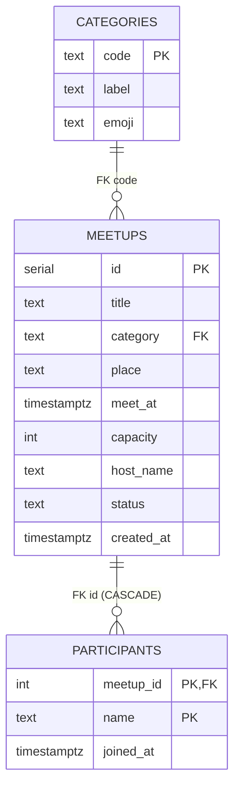

# PPT 아웃라인 — db-project

발표용 6-slide 구성. DB 전공수업 발표용 — 슬라이드마다 실제 코드·쿼리·EXPLAIN 결과를 포함한다.

---

## Slide 1 · 컨셉과 데모

**메시지**: "캠퍼스에서 30분 뒤 학식 같이 갈 사람을 모으는 가장 가벼운 게시판."

**보여줄 것**
- 한 줄 컨셉
- 스크린샷 3장: 목록 / 만들기 / 상세
- 라이브 데모는 발표 마지막에 다시 — 여기는 정지 화면만

---

## Slide 2 · 아키텍처와 시스템 구성

**메시지**: "Next.js → Express → PostgreSQL 3-레이어. 데이터 모델은 단 3개 테이블."

**아키텍처 다이어그램**

```
Browser ─ HTTP ─→ Next.js (3000) ─ HTTP ─→ Express (3001) ─ pg pool ─→ PostgreSQL (5432)
   ▲              SSR/RSC               얇은 라우트          deep module        Docker
   │                                                          (db.js)
   └─────────────────────────────────────────────────────────────── 단방향 흐름
```

**의도적 분리 이유**
- 백엔드와 프론트 책임 분리 → "DB 가 어떻게 호출되는지" 가 코드에서 명확
- ORM 없이 직접 SQL → 학습 목표에 부합. SQL 이 그대로 코드에 노출됨
- pg 모듈만 사용 — connection pooling, parameterized query, SQLSTATE 접근 가능

**스택 결정 한 줄 요약**: "DB 학습을 가리는 추상화를 모두 걷어냈다."

---

## Slide 3a · 릴레이션 설계 — ERD와 테이블

**메시지**: "도메인 요구사항을 3개 테이블로 분해. 카테고리는 정규화로 분리."

**ERD (Mermaid)**



**관계 요약**
- `categories ─< meetups`: 1:N (카테고리는 여러 모임에 재사용)
- `meetups ─< participants`: 1:N (한 모임에 N명)
- 사용자 마스터 없음 — "이름 문자열" 그대로 저장 (인증 범위 제외)

**정규화 관점**
- `categories` 분리 결정: 라벨/이모지를 모든 `meetups` 행에 중복 저장하지 않기 위함 → **2NF 만족**
- `participants` 복합키 `(meetup_id, name)`: 한 사람 한 모임 1회 참여를 **키 자체로** 표현 → 추가 UNIQUE 제약 불필요

---

## Slide 3b · 제약조건의 의도와 SQLSTATE

**메시지**: "애플리케이션 코드보다 DB 가 먼저 무결성을 책임진다."

**제약별 의도와 SQLSTATE**

| 제약 | 위치 | 의도 | 위반 시 SQLSTATE |
|---|---|---|---|
| `PRIMARY KEY (id)` | `meetups` | 모임의 자연 식별자가 없어 SERIAL 부여 | `23505` |
| `PRIMARY KEY (meetup_id, name)` | `participants` | "한 사람 한 모임 1회 참여" 를 키로 표현 | `23505` |
| `FK category → categories.code` | `meetups` | 존재하지 않는 카테고리 차단 | `23503` |
| `FK meetup_id ON DELETE CASCADE` | `participants` | 모임 삭제 시 참여자 자동 정리 | — (cascade) |
| `CHECK capacity >= 1` | `meetups` | 의미 없는 0명 모임 방지 | `23514` |
| `CHECK status IN (open, closed, cancelled)` | `meetups` | 상태 enum 강제 | `23514` |
| `CHECK length(title) > 0` 등 | 여러 컬럼 | trim 후 빈 문자열 차단 | `23514` |
| `DEFAULT NOW()` | `created_at`, `joined_at` | 클라이언트 시각 신뢰하지 않음 | — |

---

## Slide 4a · 대표 쿼리 — JOIN + GROUP BY

**메시지**: "목록 화면은 단 1발 SQL. JOIN 으로 카테고리·참여자 정보를 합치고 GROUP BY 로 인원을 집계."

**전체 SQL** (`routes/meetups.js`)

```sql
SELECT
  m.id, m.title, m.place, m.meet_at, m.capacity,
  m.host_name, m.status,
  c.code   AS category_code,
  c.label  AS category_label,
  c.emoji  AS category_emoji,
  COUNT(p.name)::int AS joined
FROM meetups m
JOIN categories c        ON c.code = m.category        -- INNER: 카테고리는 항상 존재
LEFT JOIN participants p ON p.meetup_id = m.id          -- LEFT: 참여자 0명도 포함
WHERE m.status = 'open'
  AND m.meet_at > NOW()
  AND ($1::text IS NULL OR m.category = $1)             -- 동적 카테고리 필터
GROUP BY m.id, c.code, c.label, c.emoji                 -- m.id 가 PK 이므로 m.* 도 묶임
ORDER BY m.meet_at ASC;
```

**왜 LEFT JOIN 인가?**
- 참여자 0명인 모임도 목록에 보여야 한다.
- INNER JOIN 으로 쓰면 `joined=0` 인 모임이 결과에서 사라짐.
- LEFT JOIN 이후 `COUNT(p.name)` — NULL 은 카운트되지 않으므로 0 으로 집계됨. (`COUNT(*)` 와의 차이!)

**왜 GROUP BY 에 m.* 가 아닌 m.id 만 충분한가?**
- PostgreSQL 은 SQL:1999 의 *functional dependency* 인식.
- `m.id` 가 PK 이므로 `m.title`, `m.place` 등은 함수적으로 종속 → GROUP BY 에 명시할 필요 없음.

---

## Slide 5a · 트랜잭션 흐름 — `joinMeetup`

**메시지**: "선착순 참여는 1개의 트랜잭션 + `SELECT FOR UPDATE` 행 잠금으로 안전하게."

**트랜잭션 단계**

```
BEGIN
  ├─ 1. SELECT capacity, status, meet_at FROM meetups
  │        WHERE id=? FOR UPDATE                     -- 행 잠금
  ├─ 2. SELECT COUNT(*) FROM participants WHERE meetup_id=?
  │        if (joined >= capacity)  → ROLLBACK; reason=full
  ├─ 3. if (status != 'open' || meet_at <= NOW())
  │                                  → ROLLBACK; reason=closed
  ├─ 4. INSERT INTO participants (meetup_id, name) VALUES (?, ?)
  │        catch SQLSTATE 23505     → ROLLBACK; reason=duplicate
  ├─ 5. if (방금 정원 채워짐)
  │        UPDATE meetups SET status='closed' WHERE id=?
  └─ COMMIT
```

**각 단계의 의미**

1. **행 잠금 (`SELECT ... FOR UPDATE`)** — 같은 모임에 대한 후속 트랜잭션을 commit/rollback 까지 대기시켜 직렬화한다. 잠금 없이 진행하면 두 트랜잭션이 같은 snapshot 을 봐 정원이 초과될 수 있다.
2. **capacity 검사** — 현재 참여자 수가 정원 이상이면 `full` 로 거절. status 검사보다 먼저 수행하여, 동시성 환경에서 다른 트랜잭션이 막 정원을 채우며 status='closed' 로 바꿔둔 직후에도 사용자에게는 "정원이 찼습니다" 라는 정확한 안내를 보여줄 수 있다.
3. **status / 시각 검사** — 호스트가 명시적으로 닫았거나 시각이 과거이면 `closed` 로 거절.
4. **INSERT** — 복합 PK `(meetup_id, name)` 위반(SQLSTATE 23505)이면 `duplicate` 로 거절. 중복 방지 로직을 애플리케이션이 아닌 DB 가 강제한다.
5. **자동 마감** — 이번 INSERT 로 정원이 채워졌으면 `status='closed'` 로 업데이트. 다음 조회부터 자동으로 목록에서 사라진다.

**deep module 의 가치**
- 호출자는 `{ok:true} | {ok:false, reason}` 만 본다.
- 행 잠금·SQLSTATE·UPDATE 같은 디테일은 모듈 내부에 캡슐화.
- API 레이어(`POST /meetups/:id/join`)는 단순히 결과를 응답으로 패스스루.

---

## 발표 보조 자료 위치

- ERD, 제약조건 표, EXPLAIN ANALYZE 결과 → `README.md`
- 테스트 출력 → `cd server && npm test`
- 동시성 데모 → `cd scripts && node concurrency-demo.js`
- 슬라이스별 진행 흐름 → `docs/PRD.md` 의 "User Stories" 매핑
